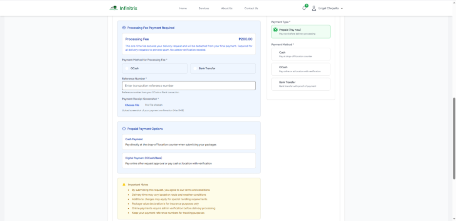
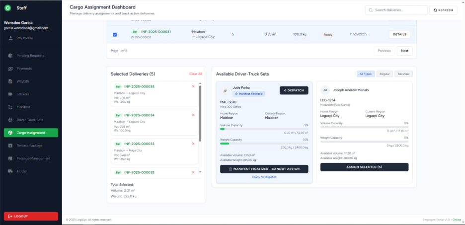
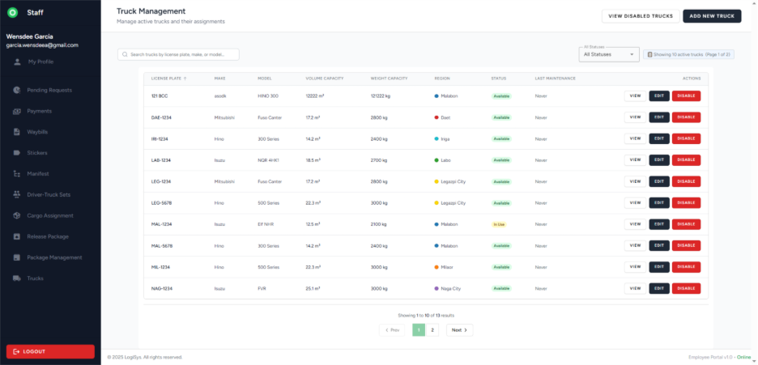
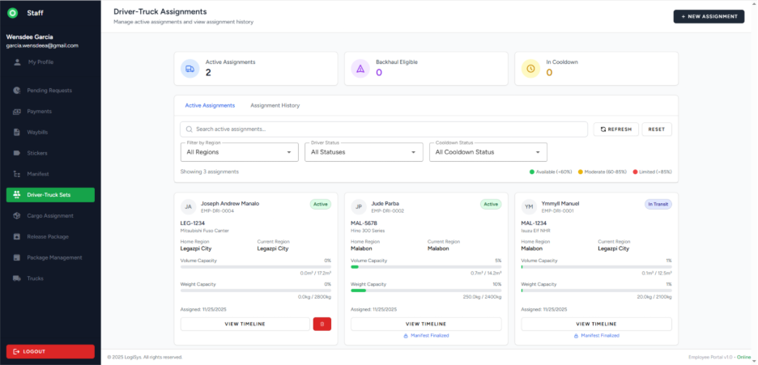
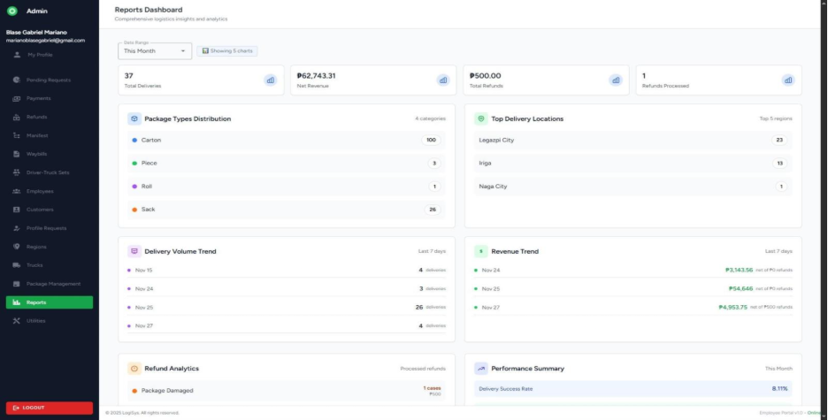
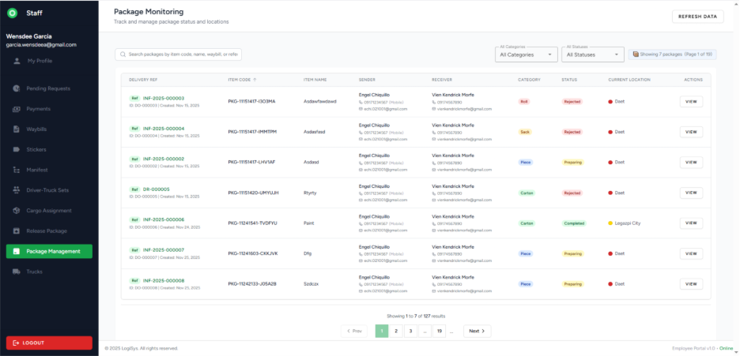

# Infinitrix Logistics Management System

**BS Computer Science Capstone Project | STI College Fairview**  
**Technical Lead:** Blaise Gabriel Mariano

A multi-role logistics platform covering the full delivery lifecycle—from customer booking and operational approval to driver dispatch, tracking, and financial settlement.

**Reference Documentation:**
- 📄 **[User Manual](docs/User_Manual.pdf)** – Complete guide to all user roles and workflows (Customers, Staff, Drivers, Collectors, Admin).
- 📊 **[Flowchart & ERD](docs/Flowchart_ERD.pdf)** – System architecture diagrams and database schema.

---

## 📌 Project Overview

This system was developed to simulate the operational workflow of a real-world courier company. It is not a basic CRUD application—it is a workflow engine with distinct portals for customers, operations staff, drivers, collectors, and administrators.

**The system manages the full delivery process:**
- Customer booking with photo verification and dynamic pricing
- Staff approval and waybill generation
- Cargo assignment and truck manifest creation
- Driver status and location updates
- Payment collection and verification
- Refund handling and reporting

---

## ⚙️ Key Features

**Multi-Portal Architecture**
- Separate, role-specific interfaces for Customers, Staff, Drivers, Collectors, and Admin.

**Booking Engine**
- Real-time pricing based on dimensions and weight.
- Mandatory photo uploads (minimum 6 images per package) for verification.
- Postpaid support (CND, Net 7, Net 15, Net 30) available after 3 completed deliveries.

**Operational Tools**
- Automated Waybill generation and batch sticker printing with PDF output.
- Driver-Truck assignment tracking capacity, cooldowns, and backhaul eligibility.
- Manifest creation and finalization before dispatch.

**Financial Workflows**
- Supports Prepaid and Postpaid transactions.
- Payment methods include Cash, GCash, and Bank Transfer.

**Admin Utilities**
- Database backup and restore.
- Data archiving for old manifests and waybills.
- Customer profile audit logs.

---

## 🛠️ Tech Stack

| Layer | Technology |
| :--- | :--- |
| Frontend | Vue.js 3, Pinia, Tailwind CSS |
| Backend | PHP 8, Laravel 10 (REST API) |
| Database | MySQL |
| Architecture | SPA with JWT Authentication |
| Tools | Git, Composer, NPM |

---

## 📸 Screenshots

| Customer Booking | Staff Pending Requests | Delivery Completion |
| :---: | :---: | :---: |
| [](docs/screenshots/image20.png) | [](docs/screenshots/image28.png) | [](docs/screenshots/image49.png) |

| Driver-Truck Assignment | Admin Reports | Package Monitoring |
| :---: | :---: | :---: |
| [](docs/screenshots/image27.png) | [](docs/screenshots/image61.png) | [](docs/screenshots/image11.png) |

---

## 👤 User Roles

- **Customer:** Request deliveries, track packages, and manage saved receiver details.
- **Staff (Operations):** Approve/reject requests, generate waybills/stickers, create driver-truck sets, manifest, and release packages.
- **Driver:** View assigned deliveries, update package status (Delivered/Damaged/Lost), and update location.
- **Collector (Finance):** Manage pending and postpaid collections, submit verification, and track performance.
- **Admin:** Verify payments, manage refunds/adjustments, handle employees/customers, configure warehouses, and use system utilities.

---

## 🏗️ Architecture

- **Frontend (Vue.js SPA)** communicates with the backend via RESTful APIs.
- **Backend (Laravel)** handles business logic, file storage, and database operations.
- **Database (MySQL)** is normalized to support complex joins for pricing, routing, and financials.

**Technical Decisions:**
- Pricing uses a configurable matrix (Base + Volume + Weight + Package fee), not hardcoded values.
- The booking process uses Pinia to manage state across multi-step forms.
- Role-Based Access Control (RBAC) is enforced via Laravel middleware, dynamically rendering the correct dashboard on the frontend.
- All parcel photos and receipts are validated and stored using Laravel's filesystem.

---

## 🗄️ Database Overview

- **Users & Roles:** Single `users` table with role column; extended by role-specific profile tables.
- **Deliveries:** Central table linking senders and receivers (users or guests).
- **Driver-Truck Sets:** Pivot table tracking history, capacity, and cooldowns.
- **Financials:** Separate tables for prepaid payments and postpaid collections for clear auditing.

---

## 🚀 Installation

**Requirements:** PHP 8.1+, Composer, Node.js, MySQL

```bash
git clone https://github.com/DaoBy/infinitrix-logistics-system-alpha.git
cd infinitrix-logistics-system-alpha

composer install
npm install
npm run dev

cp .env.example .env
php artisan key:generate

# Configure your database credentials in .env

php artisan migrate --seed
php artisan serve